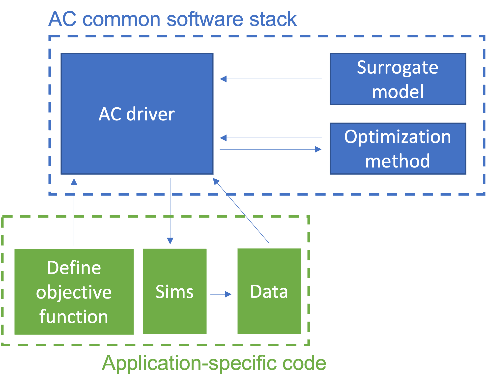
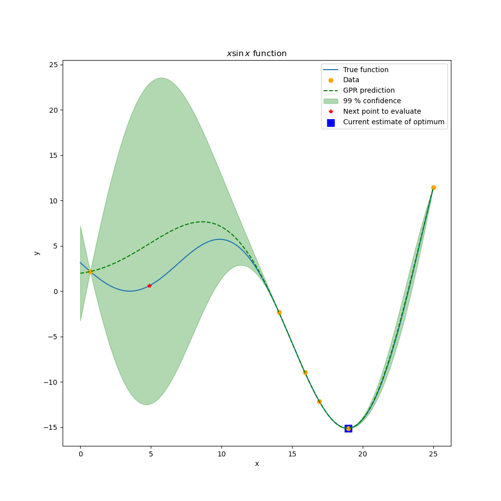
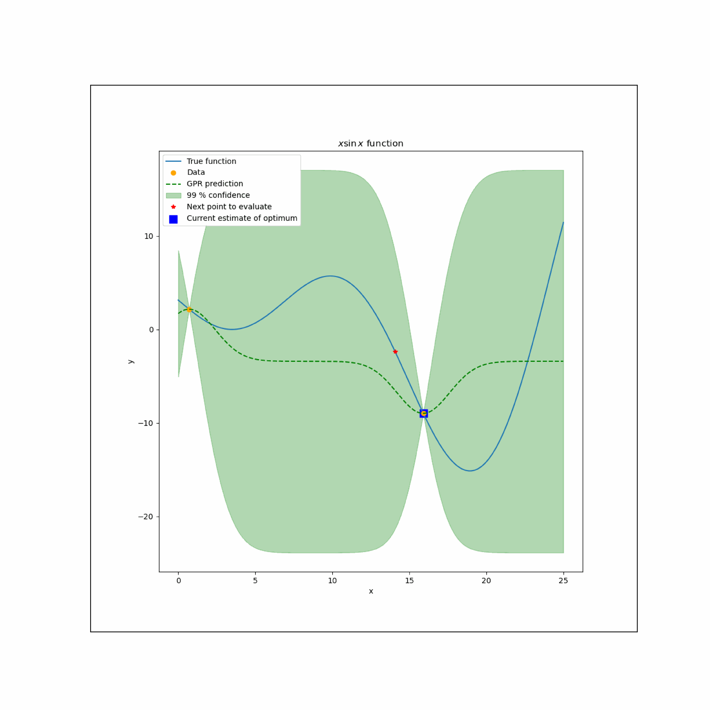
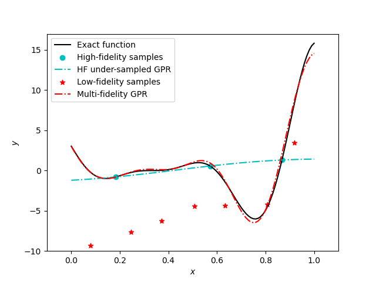

# Adaptive Computing
This repository contains the Adaptive Computing (AC) common software stack, which supports goal-based computing. As shown in the image below, the AC driver is designed to provide a simple and stable interface between: 

1. surrogate modeling and optimization tools (which are part of the AC common software) 
2. and user-defined application-specific simulation code.

<figure align = "center"><figcaption align = "center"><b>This repository encompasses the blue dashed box.</b></figcaption></figure>

Application-specific code defines an objective, which may be to solve a global optimization problem or to train a surrogate model with minimal uncertainty. Then, the AC driver decides where in the design parameter space to run simulations to best achieve that objective. This process is iterative; as new data is returned from simulations, the AC driver chooses new simulations to run. 

Target applications of AC at NREL include-

* Optimizing the chemical process of converting biomass to biofuel
* Automating the training of surrogate models for Kinetic Monte Carlo simulations for materials synthesis
* Multifidelity simulations of the energy grid at the neighborhood scale

Key capabilities-

* Bayesian optimization
* Gaussian process modeling
* Continuous and discrete design parameters
* Uncertainty quantification
<!-- * Uncomment this line when bayesOpt n_iter >0 is supported: Support for multi-fidelity modeling --->

## Package details

### Explanation of the `bayesOpt` function
The workhorse of the AC package is the `bayesOpt` function. This function performs Bayesian optimization, a technique for surrogate-based optimization, which is illustrated in the figure below. In this simple 1 parameter example, the user defines a python function which returns the value of the `x sin(x)` function. `bayesOpt` sees this as a black-box function which it can evaluate at various parameter (`x`) values. 

`bayesOpt` begins with a few random function evaluations. These can be provided at specified points in the design parameter space or can be automatically selected using Latin Hypercube Sampling. The inital data points are used to train a Gaussian Process (GP) model of the black-box function. The GP model provides an estimate of the function, which is the mean of the GP (also called a Gaussian Process Regression and is essentially a smooth interpolation of the sampled points) and the variance of the GP model which estimates the uncertainty of the GPR in between sampled data points. 

<figure align = "center"><figcaption align = "center"><b>A limited number of function evaluations are used to train a GP. We plot the GPR estimate and its confidence intervals, the sample points, and the reference exact function.</b></figcaption></figure>

So far, the Bayesian optimization has not started, we have just performed regression on some sample points. Bayesian optimization is the iterative selection of additional sample points in a way that optimizes some objective. This is stated mathematically by defining an acquisition function (details to follow). For example, below the evolution of the optimization is shown where in each iteration one sample is chosen that has the highest likelihood of having a deeper minimum than any previously sampled point.

<figure align = "center"><figcaption align = "center"><b>Left: Animation (gif) of the Bayesian Optimization algorithm for a 1 parameter function. Right: still frame illustrating that for the chosen acquisition function, the next function evaluation will be chosen at a parameter value where there is large uncertainty.</b></figcaption></figure>

`bayesOpt` is called with the arguments `simulations`, `params`, and `options`, which are described next.

### User-defined simulations
`simulations` is the name of the user-defined function that implements a simulation. The form is `f(x)`, where `x` is a list of arguments. In the example above, it was a simple function that evaluates `a*x*sin(x/b-c)`. In a multi-fidelity setting, `simulations` is a list of the user-defined functions that implement simulations which various cost and accuracy. This represents a hierarchy of simulation fidelities. More information on multi-fidelity is available further down this page. Note, all simulations must take the same arguments and return the same scalar output.

~~~{.bash}
import high_fidelity as high_fidelity
import low_fidelity as low_fidelity
# List of user-defined function names
simulations = [high_fidelity, low_fidelity]
~~~

### Parameter list
A list of `Param` objects, each of which specifies the type and range of allowable values for one argument the user-defined functions.

~~~{.bash}
x0 = Param()
# x0.type = 'continuous' # this is the default type, so don't need to specify the type explicitly
x0.minVal = 0
x0.maxVal = 8

x1 = Param()
x1.type = 'ordered'
x1.minVal = 2
x1.maxVal = 6 # domain: 2,3,4,5,6.

x2 = Param()
x2.type = 'categorical'
x2.categories = ['a','b','c','d']

params = [x0, x1, x2]

# example of calling a function follows the constraints defined by params
low_fidelity(3.14, 6, 'c')
~~~

The user-defined simulations can have arguments of three different types:

* `continuous` parameters are the default type and are floating point numbers that can take any value from `minVal` to `maxVal` (inclusive). The `minVal` and `maxVal` fields must be specifed. 
* `ordered` parameters are integers. Such a parameter can take any value from `minVal` to `maxVal` (inclusive). The `minVal` and `maxVal` fields must be specifed. Use an ordered integer when the order of the discrete values has significance, that is, we expect neigboring values to have simulation output values that are correlated.
* `categorical` parameters are represent a discrete list of possibilties. Instead of specifying `minVal` and `maxVal`, the `categories` field lists the discrete string values that the variable can take. This type should be used when the order of values in `categories` is arbitrary (this is what makes this type different from representing options with ordered integers).

### Optimization options
The `Options` object specifies how the optimization is conducted. After initializeing the object, its default fields can be overwritten and optional fields can be set.

~~~{.bash}
options = Options()
# example of overwriting a default field:
options.acqFunc = 'LCB'
# example of setting an optional field:
options.input_data_filenames = ['low_fidelity.csv','high_fidelity.csv']
~~~

Available options:

| Field name | Default |  Acceptable types |  Acceptable values | Description  |
|---|---|---|---|---|
| `input_data_filenames` | none | string, list of strings  | empty string or strings ending in `.csv`  |  file names to read existing data from. List length must equal the number of  simulations provided. |
| `acqFunc`  | `EI`  |  string |  `EI`,`LCB`,`SBO`,`MSD` | Chose which acquisition function to use for the optimization. See descriptions below.  |
| `n_iter`  | 15  | integer  |  positive or zero | Number of Bayesian Optimization iterations. |
| `n_init_samp`  | `n_dim+1`  | integer  | positive or zero | Number of pseudo-random initial samples collected using Latin Hypercube Sampling used to initialize the Bayesian Optimization. |
| `deterministic`  |  True | boolean | `True` or `False` |  True: random seeds for sampling are chosen deterministically so that results are reproducible. |
| `animate_1D`  | False  | boolean  | `True` or `False` |  True: show and save a movie of the Bayesian Optimization iterations. `nDim` must = 1. |
| `animate_2D`  | False  | boolean  | `True` or `False` |  True: show and save a movie of the Bayesian Optimization iterations. `nDim` must = 2. |
| `animate_ND`  | False  | boolean  | `True` or `False` |  True: show and save a movie of the Bayesian Optimization iterations. |
| `plot_1D`  | False  | boolean  | `True` or `False` |  True: show and save a plot of the final result of the optimization. `nDim` must = 1. |
| `plot_2D`  | False  | boolean  | `True` or `False` |  True: show and save a plot of the final result of the optimization. `nDim` must = 2. |
| `plot_ND`  | False  | boolean  | `True` or `False` |  True: show and save a plot of the final result of the optimization. |
| `output_dir`  | none | string | any |  All plots and animations are saved to `./output_dir/`. The directory is created if it doesn't exist. |

<!-- |   |   |   |   |    | -->

#### More information about acquisition functions
The follow is a list of supported acquisition functions. These determine which function evaluation will be made on the present iteration. Note that `EI`, `LCB`, and `SBO` are written to find the global minimum, so the objective function should be negated if the maximum is sought.

* Set `options.acqFunc = EI` to use the Expected Improvement algorithm. [Click here](https://www.cse.wustl.edu/~garnett/cse515t/spring_2015/files/) for a description of the algorithm. As this acquisition function is widely used and generally recommended, it is the default value.
* `options.acqFunc = LCB` to use the Lower Confidence Bound algorithm. This queries the point in the design space where the surrogate's mean minus 3 times its variance is minimal. Thus, it probes the point where the 99% conficence interval is lowest. This acquisition function can converge quickly but is not particularly robust.
* `options.acqFunc = SBO` to use the Surrogate-Based Optimization algorithm. This queries the point in the design space where the surrogate's mean is minimal. This acquisition function is generally only useful for finding local minima and is not particularly robust though it can converge quickly.
* `options.acqFunc = MSD` to use the Maximal Standard Deviation algorithm. This queries the point in the design space that has the largest standard deviation estimated by the surrogate model. 

### Calling `bayesOpt`

~~~{.bash}
x_opt, y_opt, ind_best, x_data, y_data, surrogate = bayesOpt(simulations, params, options)
~~~

`bayesOpt` returns following data:

* `y_opt`the optimal value and `x_opt` its corresponding parameters
* `x_data` and `y_data` are lists of all the of function evaluations made
* `surrogate` an object representing the final surrogate (GP) model trained.

## Multi-fidelity
See the tutorial for more details on use. Presently, multi-fidelity is only supported when `options.n_iter=0`. Bayesian Optimization support will be added soon.

<figure align = "center"><figcaption align = "center"><b>Comment.</b></figcaption></figure>

## Package organization and file strucutre
* The `bayesOpt` function is implmented in `ac_common/opt.py`. Other supporting functions can be found in `ac_common/`, which is the main directory for the AC common software stack.
* The `tutorials` directory contains several example programs which demonstrate the capabilities and usage of `bayesOpt` with various options and objective functions.

The available tutorials are listed below:

* `example_1d` finds the minimum of `f(x) ~ x sin(x)`. Animate the evolution of the Bayesian optimization and how the Gaussian Process Regression (GPR) and its uncertainty evolves with each iteration.
* `example_2d` finds the minimum of a 2D paraboloid.
* `example_3d` finds the minimum of a 3D paraboloid.
* `example_mixed_type` is similar to `example_3d` except that two of the variables are replaced with ordered integer and categorical types.
* `example_read_file` same as `example_mixed_type` except that it reads data from a csv file instead of using pseudo-random initial sampling.
* `example_multifidelity_1d` train a GPR using high fidelity and low fidelity function evaluations. Note: this function is not iterative yet. It uses pseudo-random sampling to find the minimum.
* `example_multifidelity_mixed_type_read_file_2d` same as `example_multifidelity_1d` except it adds a categorical variable, so it uses mixed types. Also, it reads some initial data from csv files and collects some from pseudo-random initial sampling.

The following tutorial(s) are coming soon:

* `example_step_1d` uses the MSD acquistion function to place points to minimize variance estimated in the surrogate model rather than searching for a minimum of the predicted mean of the model.

#### Python and Jupyter notebooks
* Each example directory contains a driver (main) program with `.py` and `.md` extensions. These are identical except for formatting differences. The `.py` is a python script which can be run from the command line or in an IDE. The `.md` file is a Jupyter notebook. Note that with Jupytext, the markdown files can be used just like `.ipynb` notebook files, except that the output will not be saved when they are closed. This aids with version control using git.  	 

## Installing AC

### Download the source code

~~~{.bash}
git clone https://github.nrel.gov/AC/AdaptiveComputing.git
~~~

### Environment and dependencies

* Python (haven't tested which versions will work, but I am using Python 3.9.13 from a recent conda distribution)
* The surrogate modeling toolbox (SMT)
* Optional: Jupyter notebooks and Jupytext

#### Option 1: Install using a package manager
For example, on mac

~~~{.bash}
brew install conda 
pip install smt
pip install jupytext
~~~

#### Option 2: create a conda environment
More instructions coming soon ... 

## Running AC

* Change the working directory to an example directory. E.g.,

~~~{.bash}
cd tutorial/example_1d
~~~

### Option 1: Run using python

* From the command line, run

~~~{.bash}
python driver_1d.py
~~~

### Option 2: Run using a Jupyter notebook

* Launch the jupyter notebook server

~~~{.bash}
jupyter notebook
~~~

* Navigate in the GUI to open `driver_1d.md`
* Note that github has been configured to only track `.md` files rather than `.ipynb` files. This is because markdown files work better with git's version control software. However, '.md' files do not store the output and figures from notebooks, so if you want to save this, you can save the notebook as a `.ipynb`.
